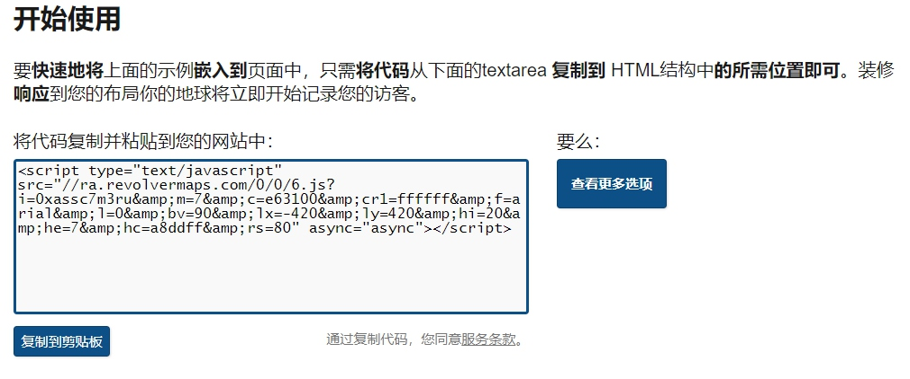
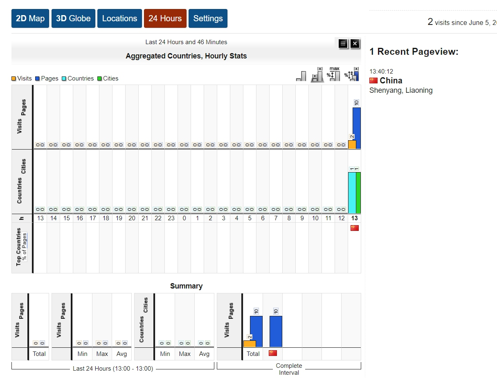

# 基于SSH框架的网上商城
## 前台
### 注册
- JS非空校验
- Struts2数据校验
- AJAX校验用户名是否存在
- 发送激活邮件
    - 点击邮件中链接地址，对用户进行激活
- 验证码程序
### 登录
- 数据校验
- 激活后的用户才可以登录
- 验证码程序
### 退出
- 销毁session
### 商品分类
- 查询一级分类:显示到菜单位置
- 查询一级分类:关联二级分类
- 根据一级分类查询到二级分类
### 首页
- 查询热门商品
    - 检索10个热门商品，按数据库中的字段
- 查询最新商品
    - 检索10个最新商品，按时间排序
- 根据商品ID检索商品
    - 显示商品详情
### 购物车模块
- 添加到购物车
    - 将购物项添加到购物车
        - 如果购物项已经存在，那么数量和小计需要增加
        - 如果购物项没有在购物车中，添加一个新的购物项
    - 清空购物车
        - 将购物车中所有的购物项清空
    - 从购物车中移除
        - 将某一个购物项从购物车中移除
### 订单模块
- 保存订单
    - 数据从购物车中获取
- 显示某个订单
    - 根据订单ID检索订单
- 查询我的订单
    - 根据用户ID检索订单
- 在线支付
    - 使用第三方支付平台，易宝支付，对订单进行付款
## 后台
### 一级分类
- 查询所有一级分类(分页)
- 添加一级分类
- 修改一级分类
- 删除一级分类(级联二级)
### 二级分类
- 查询所有二级分类(分页)
- 添加二级分类(所属一级分类)
- 修改二级分类(所属一级分类)
- 删除二级分类
### 商品模块
- 查询所有商品(分页)
- 添加商品(上传商品图片)
- 修改商品(修改上传图片)
- 删除商品(同时删图片)
### 订单模块
- 查询所有订单(分页)
- 按订单状态查询(分页)
- 订单发货
## 给网站前台加个球

### 特征
- 访客IP地点统计
- 访客人数统计
- 页面停留时间统计
- 多样式定制
- 免费、易用
### 使用方法
- 访问 https://www.revolvermaps.com
- 复制脚本代码

### 效果

- 还有各种样式可以自己定义，具体可以查看网站https://www.revolvermaps.com
- 完全免费、开源
